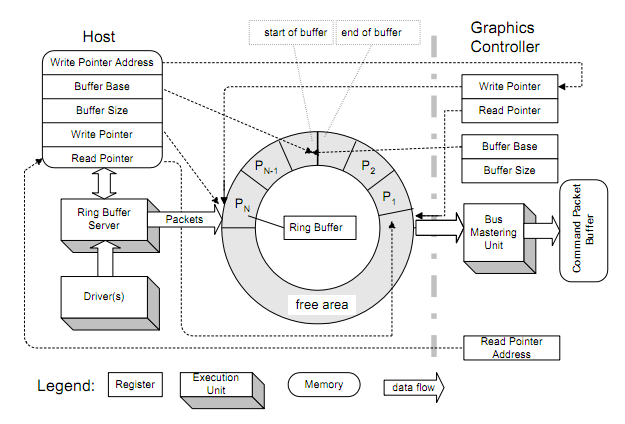

# AMD GPU Ring Buffer Architecture

## Background

In modern GPU architectures, efficient communication between CPU and GPU is crucial for performance. AMD's GPU driver implements a sophisticated **Ring Buffer** mechanism that enables asynchronous command submission and execution. This article explores how the current AMD GPU Linux kernel driver (AMDGPU) implements ring buffers based on the latest code.

## GPU Communication Models

There are fundamentally two approaches to control hardware:

**PUSH Model**: The CPU directly controls the GPU by reading/writing hardware registers
- **Pros**: Simple, deterministic, immediate feedback
- **Cons**: Synchronous, consumes CPU time, unsuitable for high-throughput workloads

**PULL Model**: The CPU writes commands into buffers, GPU fetches and executes them
- **Pros**: Asynchronous, parallel execution, efficient for GPU workloads
- **Cons**: More complex, requires synchronization mechanisms

AMD GPUs use the **PULL model** through ring buffers for optimal performance.

## What is the AMD GPU Ring Buffer?

Think of it as a **producer-consumer circular queue**:

```
CPU (Producer) → [Ring Buffer] ← GPU (Consumer)
                      ↓
               Shared Memory Region
```



The ring buffer consists of:
- **Buffer Base**: Physical memory address accessible by both CPU and GPU
- **wptr (Write Pointer)**: Managed by CPU, points to next write location
- **rptr (Read Pointer)**: Updated by GPU, points to next read location
- **Buffer Size**: Predefined circular buffer size

### Buffer Status Logic

```c
// Buffer status check logic
if (rptr == wptr) {
    // Buffer is empty, no commands to process
    return RING_EMPTY;
} else {
    // Buffer has commands, GPU will execute them
    return RING_HAS_COMMANDS;
}
```

## Current Ring Buffer Data Structures

### Core Ring Structure

```c
//drivers/gpu/drm/amd/amdgpu/amdgpu_ring.h
struct amdgpu_ring {
    struct amdgpu_device        *adev;
    const struct amdgpu_ring_funcs *funcs;
    
    /* Ring buffer memory */
    struct amdgpu_bo           *ring_obj;
    uint32_t                   *ring;           /* CPU mapping */
    uint64_t                   gpu_addr;        /* GPU address */
    unsigned                   ring_size;       /* Size in bytes */
    
    /* Pointer management */
    u64                        wptr;            /* Write pointer */
    u64                        wptr_old;        /* Previous wptr */
    unsigned                   rptr_offs;       /* rptr offset */
    u64                        rptr_gpu_addr;   /* rptr GPU address */
    u32                        *rptr_cpu_addr;  /* rptr CPU mapping */
    
    /* Buffer masks and limits */
    uint64_t                   ptr_mask;        /* 64-bit pointer mask */
    uint32_t                   buf_mask;        /* Buffer wrap mask */
    unsigned                   max_dw;          /* Max DWords per submission */
    int                        count_dw;        /* Current allocation count */
    
    /* Doorbell mechanism */
    u32                        doorbell_index;  /* Doorbell register index */
    bool                       use_doorbell;    /* Use doorbell vs register */
    u32                        *wptr_cpu_addr;  /* wptr CPU mapping */
    u64                        wptr_gpu_addr;   /* wptr GPU address */
    
    /* Ring identification */
    char                       name[16];        /* Ring name */
    enum amdgpu_ring_type      type;           /* Ring type */
    u32                        idx;            /* Ring index */
};
```

## Hardware Ring Queues in Modern AMD GPUs

Current AMD GPUs support multiple ring types with varying quantities:

| Engine | Ring Count | Purpose | Notes |
|--------|------------|---------|-------|
| **GFX** | 1-2 | 3D Graphics rendering | High-performance 3D, multiple priorities |
| **Compute** | 8-32 | Mathematical computation | Matrix operations, ML workloads |
| **SDMA** | 1-4 | System DMA operations | Memory copy/fill/move operations |
| **VCN_DEC** | 1-2 | Video decode | Hardware video decoding (VCN replaces UVD) |
| **VCN_ENC** | 1-2 | Video encode | Hardware video encoding (VCN replaces VCE) |
| **VCN_JPEG** | 1-2 | JPEG decode/encode | Dedicated JPEG processing |
| **VPE** | 1-2 | Video Processing Engine | Video post-processing |
| **KIQ** | 1 | Kernel Interface Queue | Special control ring |
| **MES** | 1+ | Micro Engine Scheduler | Hardware scheduling |
| **UVD** | Legacy | Legacy Video Decode | Replaced by VCN_DEC in modern GPUs |
| **VCE** | Legacy | Legacy Video Encode | Replaced by VCN_ENC in modern GPUs |

### Engine Evolution Notes

**Important**: AMD has transitioned from older **UVD (Universal Video Decoder)** and **VCE (Video Compression Engine)** to the modern **VCN (Video Core Next)** architecture starting with Vega and continuing through RDNA/CDNA generations. VCN provides:

- **Better Power Efficiency**: Improved power management for video workloads
- **Higher Performance**: Enhanced throughput for 4K/8K video processing  
- **Modern Codecs**: Support for AV1, H.265/HEVC, VP9 hardware acceleration
- **Unified Architecture**: Single video engine handling both encode/decode

### Maximum Ring Limits

```c
#define AMDGPU_MAX_RINGS        149
#define AMDGPU_MAX_HWIP_RINGS   64
#define AMDGPU_MAX_GFX_RINGS    2
#define AMDGPU_MAX_COMPUTE_RINGS 8
```

## Command Packet Formats

### PM4 (Packet Manager 4) - The Command Processor Language

**PM4** is AMD's **native command format** used by the Command Processor (CP) hardware to control GPU operations. PM4 has been the foundation of AMD GPU command submission since the R600 generation (2006) and continues to be the primary interface for all AMD RDNA and CDNA architectures.

#### **What is PM4?**

PM4 (Packet Manager 4) serves as the **instruction set for the GPU's Command Processor**, which acts as a dedicated microcontroller responsible for:

- **Command Parsing**: Reading and interpreting commands from ring buffers
- **State Management**: Tracking GPU pipeline state and context switching
- **Resource Management**: Managing memory, synchronization, and resource allocation
- **Hardware Control**: Configuring graphics and compute engines

#### **PM4 Packet Structure and DWords**

AMD GPUs use a **packet-based command format** where commands consist of **DWords (32-bit words)**. All PM4 commands are structured as sequences of DWords for hardware optimization:

**Why DWords (32-bit)?**
- **Hardware Alignment**: AMD GPU command processors are optimized for 32-bit aligned memory access
- **Efficient Addressing**: PCIe and GPU memory controllers work optimally with 32-bit boundaries  
- **Register Interface**: GPU registers are inherently 32-bit, matching the command word size
- **Atomic Operations**: 32-bit writes are guaranteed atomic on modern CPU and GPU architectures

**Real PM4 Command Example** (from `drivers/gpu/drm/amd/amdgpu/gfx_v11_0.c`):
```c
// PACKET3_SET_RESOURCES command - 8 DWords total
amdgpu_ring_write(kiq_ring, PACKET3(PACKET3_SET_RESOURCES, 6));  // Header: 1 DWord
amdgpu_ring_write(kiq_ring, PACKET3_SET_RESOURCES_VMID_MASK(0)); // Param 1: 1 DWord  
amdgpu_ring_write(kiq_ring, lower_32_bits(queue_mask));          // Param 2: 1 DWord
amdgpu_ring_write(kiq_ring, upper_32_bits(queue_mask));          // Param 3: 1 DWord
amdgpu_ring_write(kiq_ring, lower_32_bits(shader_mc_addr));      // Param 4: 1 DWord
amdgpu_ring_write(kiq_ring, upper_32_bits(shader_mc_addr));      // Param 5: 1 DWord
amdgpu_ring_write(kiq_ring, 0);                                  // Param 6: 1 DWord  
amdgpu_ring_write(kiq_ring, 0);                                  // Param 7: 1 DWord
// Total: 8 DWords = 32 bytes
```

**Type 0 (PACKET0)**: Direct register writes (from `drivers/gpu/drm/amd/amdgpu/soc15d.h`)
```c
#define PACKET0(reg, n) ((PACKET_TYPE0 << 30) | ((reg) & 0xFFFF) | ((n) & 0x3FFF) << 16)

// Header format: [31:30]=0, [29:16]=COUNT, [15:0]=REG_OFFSET
// Writes (n+1) consecutive DWords to registers starting from REG_OFFSET
// Example: PACKET0(mmUVD_SEMA_WAIT_FAULT_TIMEOUT_CNTL, 0) - writes 1 DWord to register
// Used in: drivers/gpu/drm/amd/amdgpu/uvd_v4_2.c, amdgpu_jpeg.c
```

**Type 2 (PACKET2)**: Filler/Padding packets  
```c
#define CP_PACKET2 0x80000000
// Header format: [31:30]=2, [29:0]=FILLER_DATA  
// Used for memory alignment and no-operation padding
// Essential for maintaining proper command alignment
```

**Type 3 (PACKET3)**: Primary command format (modern standard)
```c
// Header format from drivers/gpu/drm/amd/amdgpu/soc15d.h
#define PACKET3(op, n) ((PACKET_TYPE3 << 30) | (((op) & 0xFF) << 8) | ((n) & 0x3FFF))

// Field breakdown:
// [31:30] = 3           (Packet Type)
// [29:16] = Reserved    (Future extensions)  
// [15:8]  = IT_OPCODE   (Instruction opcode - see below)
// [13:0]  = COUNT       (Payload length - 1)
```

#### **PM4 Architecture Benefits**

1. **Hardware Acceleration**: Commands executed directly by dedicated CP hardware
2. **Asynchronous Execution**: CPU can queue commands without waiting for completion
3. **Context Switching**: Efficient switching between graphics and compute workloads
4. **Memory Coherency**: Built-in cache management and memory synchronization
5. **Error Handling**: Hardware-level error detection and recovery

### Common PKT3 Opcodes - The Command Vocabulary

PM4 PKT3 opcodes represent **specific hardware operations** that the Command Processor can execute. Here are the key opcodes used in modern AMD GPU drivers:

```c
//drivers/gpu/drm/amd/amdgpu/soc15d.h (and similar in vid.h, nvd.h, cikd.h)

// === Basic Operations ===
#define PACKET3_NOP                    0x10  // No operation (padding/sync)
#define PACKET3_SET_BASE              0x11  // Set base address for operations  
#define PACKET3_CLEAR_STATE           0x12  // Clear GPU pipeline state
#define PACKET3_INDEX_BUFFER_SIZE     0x13  // Set index buffer size

// === Compute Operations ===
#define PACKET3_DISPATCH_DIRECT       0x15  // Launch compute shader directly
#define PACKET3_DISPATCH_INDIRECT     0x16  // Launch compute via indirect buffer

// === Memory Operations ===
#define PACKET3_ATOMIC_MEM            0x1E  // Atomic memory operations
#define PACKET3_WRITE_DATA            0x37  // Write data to memory/registers
#define PACKET3_COPY_DATA             0x40  // Copy data between locations

// === Control Flow ===
#define PACKET3_COND_EXEC             0x22  // Conditional execution
#define PACKET3_PRED_EXEC             0x23  // Predicated execution
#define PACKET3_INDIRECT_BUFFER       0x3F  // Execute indirect command buffer

// === Synchronization ===
#define PACKET3_WAIT_REG_MEM          0x3C  // Wait for register/memory condition
#define PACKET3_MEM_SEMAPHORE         0x39  // Memory semaphore operations
#define PACKET3_RELEASE_MEM           0x49  // Memory release with fence

// === Graphics Pipeline ===
#define PACKET3_DRAW_INDEX_AUTO       0x2D  // Auto-generate draw indices
#define PACKET3_DRAW_INDIRECT         0x24  // Indirect draw commands
#define PACKET3_SET_UCONFIG_REG       0x79  // Set user config register

// === Advanced Features (RDNA) ===
#define PACKET3_EVENT_WRITE           0x46  // Write GPU events
#define PACKET3_EVENT_WRITE_EOP       0x47  // End-of-pipe event with cache flush
```

#### **PKT3 Command Categories**

**1. State Management**
- `PACKET3_CLEAR_STATE`: Resets GPU pipeline to known state
- `PACKET3_SET_BASE`: Establishes base addresses for shaders/resources
- `PACKET3_SET_UCONFIG_REG`: Configures user-accessible registers

**2. Compute Dispatch** 
- `PACKET3_DISPATCH_DIRECT`: Direct compute shader launch with threadgroup counts
- `PACKET3_DISPATCH_INDIRECT`: Compute launch with GPU-generated parameters

**3. Memory Management**
- `PACKET3_WRITE_DATA`: High-performance data writes to GPU memory
- `PACKET3_ATOMIC_MEM`: Hardware-accelerated atomic operations
- `PACKET3_COPY_DATA`: Efficient memory-to-memory transfers

**4. Synchronization & Fencing**
- `PACKET3_RELEASE_MEM`: The **primary fencing mechanism** (see fence section)
- `PACKET3_WAIT_REG_MEM`: Wait for memory/register conditions
- `PACKET3_MEM_SEMAPHORE`: GPU semaphore operations

#### **AMD GPU Architecture Evolution**

PM4 has evolved alongside AMD's GPU architectures:

| **Architecture** | **Era** | **PM4 Features** | **Documentation** |
|------------------|---------|------------------|-------------------|
| **R600/R700** | 2006-2009 | Basic PM4, PKT0/PKT3 | Historical |
| **GCN 1-3** | 2012-2015 | Enhanced compute, async | [GCN3 ISA](https://www.amd.com/system/files/TechDocs/gcn3-instruction-set-architecture.pdf) |
| **Vega** | 2017 | Advanced features, HBM | [Vega ISA](https://www.amd.com/system/files/TechDocs/vega-shader-instruction-set-architecture.pdf) |
| **RDNA 1** | 2019 | Wave32, new cache hierarchy | [RDNA ISA](https://www.amd.com/system/files/TechDocs/rdna-shader-instruction-set-architecture.pdf) |
| **RDNA 2** | 2020 | Hardware RT, VRS, mesh shaders | [RDNA2 ISA](https://www.amd.com/system/files/TechDocs/rdna2-shader-instruction-set-architecture.pdf) |
| **RDNA 3** | 2022 | Chiplet design, enhanced RT | [RDNA3 ISA](https://www.amd.com/system/files/TechDocs/rdna3-shader-instruction-set-architecture-feb-2023_0.pdf) |
| **RDNA 4** | 2025 | Matrix cores, AI acceleration | [RDNA4 ISA](https://www.amd.com/content/dam/amd/en/documents/radeon-tech-docs/instruction-set-architectures/rdna4-instruction-set-architecture.pdf) |

#### **PM4 vs Other Command Formats**

**PM4 vs DirectX/Vulkan APIs**: 
PM4 is the **low-level hardware interface** that high-level graphics APIs ultimately translate to:
- **DirectX 12/11**: The DirectX runtime translates D3D commands into PM4 packets for AMD hardware
- **Vulkan**: Vulkan drivers convert VkCmd* functions into PM4 command streams 
- **OpenGL**: Legacy OpenGL state changes are batched and converted to PM4 packets
- **Translation Layer**: User-mode drivers (UMD) perform this translation, kernel driver only sees PM4

**PM4 vs AQL (Architected Queuing Language)**:
AQL and PM4 serve different purposes in the AMD ecosystem:
- **AQL Usage**: HSA/ROCm compute workloads use AQL packets for **compute-only dispatch**
- **AQL Structure**: Fixed 64-byte packet format optimized for HSA compute kernels
- **PM4 Usage**: **Graphics, video, and general GPU control** still use PM4 packets
- **Coexistence**: Modern AMD GPUs support both - AQL queues for compute, PM4 for everything else
- **Driver Implementation**: `drivers/gpu/drm/amd/amdgpu/amdgpu_amdkfd*.c` handles AQL, PM4 handled by main driver

**PM4 vs NVIDIA's Command Streams**:
Fundamental architectural differences between AMD and NVIDIA approaches:
- **AMD PM4**: **Publicly documented** packet format with open-source driver support
- **NVIDIA Methods**: Proprietary "pushbuffer methods" with limited public documentation
- **Flexibility**: AMD's packet-based approach vs NVIDIA's method-based approach  
- **Open Source**: AMD provides complete PM4 specifications, NVIDIA methods are largely undocumented
- **Community**: PM4 enables community GPU driver development (Mesa, etc.)

**PM4 vs Intel GPU Command Streams**:
Intel uses a different architecture for their integrated GPUs:
- **Intel Ring Buffers**: Similar concept but different packet formats and opcodes
- **Intel MI_* Commands**: Intel's equivalent to AMD's PACKET3 opcodes
- **Architecture Focus**: Intel optimized for integrated graphics, AMD for discrete high-performance
- **Documentation**: Both provide open documentation, but different command set philosophies

---
*For complete PM4 documentation, see [AMD GPU Architecture Programming Documentation](https://gpuopen.com/amd-gpu-architecture-programming-documentation/) on GPUOpen.*

## Ring Buffer Operations

### 1. Ring Allocation

```c
//drivers/gpu/drm/amd/amdgpu/amdgpu_ring.c
int amdgpu_ring_alloc(struct amdgpu_ring *ring, unsigned int ndw)
{
    // Align to hardware requirements
    ndw = (ndw + ring->funcs->align_mask) & ~ring->funcs->align_mask;
    
    // Check maximum submission limit
    if (WARN_ON_ONCE(ndw > ring->max_dw))
        return -ENOMEM;
        
    ring->count_dw = ndw;
    ring->wptr_old = ring->wptr;  // Save old position
    
    if (ring->funcs->begin_use)
        ring->funcs->begin_use(ring);  // Power gating control
        
    return 0;
}
```

### 2. Writing Commands

```c
//drivers/gpu/drm/amd/amdgpu/amdgpu_ring.h
// Write single DWORD to ring
static inline void amdgpu_ring_write(struct amdgpu_ring *ring, uint32_t v)
{
    ring->ring[ring->wptr & ring->buf_mask] = v;
    ring->wptr++;
    ring->count_dw--;
}
```

**Key Implementation Details:**
- **Power-of-2 Sizing**: Ring buffers must be power-of-2 sized for efficient wrap-around
- **Buffer Mask**: `buf_mask = (ring_size / 4) - 1` for fast modulo operations
- **Atomic Operations**: wptr updates use memory barriers to ensure visibility

### 3. Ring Commit

```c
//drivers/gpu/drm/amd/amdgpu/amdgpu_ring.h
void amdgpu_ring_commit(struct amdgpu_ring *ring)
{
    // Add padding for alignment
    uint32_t count = ring->funcs->align_mask + 1 - 
                     (ring->wptr & ring->funcs->align_mask);
    count &= ring->funcs->align_mask;
    
    if (count != 0)
        ring->funcs->insert_nop(ring, count);  // Pad with NOPs
        
    mb();  // Memory barrier
    amdgpu_ring_set_wptr(ring);  // Update hardware
    
    if (ring->funcs->end_use)
        ring->funcs->end_use(ring);  // Power gating control
}
```

## Doorbell Mechanism - Modern Implementation

The doorbell mechanism has evolved significantly. Modern AMD GPUs allocate dedicated PCIe BAR regions for doorbell registers.

### Doorbell vs Register Write

```c
////drivers/gpu/drm/amd/amdgpu/gfx_v11_0.c
static void gfx_v11_0_ring_set_wptr_gfx(struct amdgpu_ring *ring)
{
    struct amdgpu_device *adev = ring->adev;
    
    if (ring->use_doorbell) {
        // Update shared memory location
        atomic64_set((atomic64_t *)ring->wptr_cpu_addr, ring->wptr);
        
        // Ring doorbell to notify GPU
        WDOORBELL64(ring->doorbell_index, ring->wptr);
    } else {
        // Fallback: direct register write
        WREG32_SOC15(GC, 0, regCP_RB0_WPTR, lower_32_bits(ring->wptr));
        WREG32_SOC15(GC, 0, regCP_RB0_WPTR_HI, upper_32_bits(ring->wptr));
    }
}
```

### Why Doorbells?

1. **User Mode Queues**: Enables direct user space submissions
2. **Reduced Latency**: No kernel register access required  
3. **Scalability**: Each ring gets its own doorbell
4. **Power Efficiency**: GPU can sleep until doorbell rings

### Doorbell Implementation Details

Modern AMD GPUs allocate **dedicated PCIe BAR space** for doorbell registers:

- **BAR Region**: Usually BAR2 or BAR5 (varies by GPU generation)
- **Size**: Typically 8MB region divided into 8-byte doorbell slots
- **Addressing**: Each ring gets unique doorbell index
- **Atomic Operations**: Hardware ensures atomic doorbell writes

```c
// Doorbell index assignment example
ring->doorbell_index = (adev->doorbell_index.mec_ring0 + ring_id) << 1;

// Multiple doorbell writes for complex rings (VPE example)
if (ring->use_doorbell) {
    WDOORBELL64(ring->doorbell_index, ring->wptr << 2);
    if (ring->pipe == 1)  // Secondary pipe
        WDOORBELL64(ring->doorbell_index + 4, ring->wptr << 2);
}
```

## Ring Test Example: Modern Implementation

Here's how the current driver tests ring functionality:

```c
////drivers/gpu/drm/amd/amdgpu/gfx_v11_0.c
static int gfx_v11_0_ring_test_ring(struct amdgpu_ring *ring)
{
    struct amdgpu_device *adev = ring->adev;
    uint32_t scratch = SOC15_REG_OFFSET(GC, 0, regSCRATCH_REG0);
    uint32_t tmp = 0;
    unsigned i;
    int r;

    // 1. Initialize scratch register with known value
    WREG32(scratch, 0xCAFEDEAD);
    
    // 2. Allocate space in ring buffer (5 DWORDs)
    r = amdgpu_ring_alloc(ring, 5);
    if (r) {
        DRM_ERROR("amdgpu: cp failed to lock ring %d (%d).\n", 
                  ring->idx, r);
        return r;
    }

    // 3. Write command to change scratch register
    if (ring->funcs->type == AMDGPU_RING_TYPE_KIQ) {
        // KIQ uses special write register command
        gfx_v11_0_ring_emit_wreg(ring, scratch, 0xDEADBEEF);
    } else {
        // Standard rings use PACKET3_SET_UCONFIG_REG
        amdgpu_ring_write(ring, PACKET3(PACKET3_SET_UCONFIG_REG, 1));
        amdgpu_ring_write(ring, scratch - PACKET3_SET_UCONFIG_REG_START);
        amdgpu_ring_write(ring, 0xDEADBEEF);  // New value
    }
    
    // 4. Commit commands to GPU
    amdgpu_ring_commit(ring);

    // 5. Poll for completion
    for (i = 0; i < adev->usec_timeout; i++) {
        tmp = RREG32(scratch);
        if (tmp == 0xDEADBEEF)  // Success!
            break;
        if (amdgpu_emu_mode == 1)
            msleep(1);
        else
            udelay(1);
    }

    if (i >= adev->usec_timeout)
        r = -ETIMEDOUT;
        
    return r;
}
```

## Indirect Buffers (IB) - Advanced Command Submission

For complex workloads, direct ring submission can be inefficient. **Indirect Buffers** provide a solution:

### IB Structure
```c
////drivers/gpu/drm/amd/amdgpu/amdgpu_ring.h
struct amdgpu_ib {
    struct drm_suballoc    *sa_bo;      /* Suballocated buffer object */
    uint32_t               length_dw;    /* Length in DWORDs */
    uint64_t               gpu_addr;     /* GPU address */
    uint32_t               *ptr;         /* CPU mapping */
    uint32_t               flags;        /* IB flags */
};
```

### IB Submission Process

1. **Allocate IB**: Get buffer from IB pool
2. **Fill Commands**: Write commands to IB buffer  
3. **Submit to Ring**: Use `PACKET3_INDIRECT_BUFFER` to reference IB
4. **GPU Execution**: GPU jumps to IB, executes, returns to ring

### IB Pool Types
```c
enum amdgpu_ib_pool_type {
    AMDGPU_IB_POOL_DELAYED,    /* Normal submissions */
    AMDGPU_IB_POOL_IMMEDIATE,  /* High priority submissions */
    AMDGPU_IB_POOL_DIRECT,     /* Direct ring access */
    AMDGPU_IB_POOL_MAX
};
```

## Fence Mechanism - Synchronization

### Modern Fence Structure
```c
struct amdgpu_fence {
    struct dma_fence    base;           /* Linux DMA fence */
    struct amdgpu_ring *ring;           /* Associated ring */
    ktime_t            start_timestamp; /* Start time */
    u64                wptr;            /* Write pointer when emitted */
    u64                context;         /* Fence context ID */
    uint32_t           seq;             /* Sequence number */
};
```

### Fence Emission - Real Driver Implementation

```c
//drivers/gpu/drm/amd/amdgpu/gfx_v11_0.c
static void gfx_v11_0_ring_emit_fence(struct amdgpu_ring *ring, u64 addr,
                                     u64 seq, unsigned flags)
{
    bool write64bit = flags & AMDGPU_FENCE_FLAG_64BIT;
    bool int_sel = flags & AMDGPU_FENCE_FLAG_INT;

    /* RELEASE_MEM - flush caches, send int */
    amdgpu_ring_write(ring, PACKET3(PACKET3_RELEASE_MEM, 6));
    amdgpu_ring_write(ring, (PACKET3_RELEASE_MEM_GCR_SEQ |
                             PACKET3_RELEASE_MEM_GCR_GL2_WB |
                             PACKET3_RELEASE_MEM_GCR_GLM_INV | /* must be set with GLM_WB */
                             PACKET3_RELEASE_MEM_GCR_GLM_WB |
                             PACKET3_RELEASE_MEM_CACHE_POLICY(3) |
                             PACKET3_RELEASE_MEM_EVENT_TYPE(CACHE_FLUSH_AND_INV_TS_EVENT) |
                             PACKET3_RELEASE_MEM_EVENT_INDEX(5)));
    amdgpu_ring_write(ring, (PACKET3_RELEASE_MEM_DATA_SEL(write64bit ? 2 : 1) |
                             PACKET3_RELEASE_MEM_INT_SEL(int_sel ? 2 : 0)));

    /* Address must be Qword aligned for 64bit, Dword aligned for 32bit */
    if (write64bit)
        BUG_ON(addr & 0x7);  // 8-byte alignment check
    else
        BUG_ON(addr & 0x3);  // 4-byte alignment check
        
    amdgpu_ring_write(ring, lower_32_bits(addr));    // Address low
    amdgpu_ring_write(ring, upper_32_bits(addr));    // Address high
    amdgpu_ring_write(ring, lower_32_bits(seq));     // Sequence low
    amdgpu_ring_write(ring, upper_32_bits(seq));     // Sequence high
    amdgpu_ring_write(ring, 0);                      // Reserved
}
```

## Ring Buffer Memory Management

### Buffer Allocation
```c
//drivers/gpu/drm/amd/amdgpu/amdgpu_ring.c
int amdgpu_ring_init(struct amdgpu_device *adev, struct amdgpu_ring *ring,
                    unsigned int max_dw, struct amdgpu_irq_src *irq_src,
                    unsigned int irq_type, unsigned int hw_prio,
                    atomic_t *sched_score)
{
    // Calculate buffer size (must be power of 2)
    ring->ring_size = roundup_pow_of_two(max_dw * 4 * amdgpu_sched_hw_submission);
    ring->buf_mask = (ring->ring_size / 4) - 1;
    
    // Allocate GPU buffer object
    r = amdgpu_bo_create_kernel(adev, ring->ring_size + ring->funcs->extra_dw,
                               PAGE_SIZE, AMDGPU_GEM_DOMAIN_GTT,
                               &ring->ring_obj, &ring->gpu_addr,
                               (void **)&ring->ring);
    
    // Setup pointer tracking
    ring->wptr = 0;
    ring->rptr_offs = adev->wb.gpu_addr + (ring->rptr_offs * 4);
    ring->wptr_offs = adev->wb.gpu_addr + (ring->wptr_offs * 4);
    
    return 0;
}
```

### Ring Buffer Sizing: Power-of-2 Architecture

AMD GPU ring buffers **must be power-of-2 sized** for optimal hardware performance. This requirement is enforced in `amdgpu_ring_init()`:

```c
//drivers/gpu/drm/amd/amdgpu/amdgpu_ring.c
ring->ring_size = roundup_pow_of_two(max_dw * 4 * amdgpu_sched_hw_submission);
```

#### **Why Power-of-2 Sizing?**

**Mathematical Efficiency**: Power-of-2 sizes enable **bitwise AND operations** instead of expensive modulo division:

```c
// With power-of-2 size (e.g., 32KB = 32768 = 0x8000)
#define RING_SIZE_MASK (32768 - 1)  // 0x7FFF

// Fast wraparound using bitwise AND (1 CPU cycle):
next_position = (current_position + increment) & RING_SIZE_MASK;

// Instead of slow modulo operation (~20+ CPU cycles):
next_position = (current_position + increment) % 32768;
```

**Hardware Optimization Benefits**:
1. **GPU Memory Controllers**: Work more efficiently with power-of-2 aligned buffers
2. **Cache Line Alignment**: Better GPU cache utilization and reduced memory stalls
3. **MMU Performance**: GPU page tables optimized for power-of-2 memory regions
4. **DMA Efficiency**: System DMA engines prefer power-of-2 transfer sizes

#### **Ring Size Calculation**

The ring buffer size formula from the driver:
```c
final_size = roundup_pow_of_two(max_dw * 4 * sched_hw_submission)
```

**Parameter Breakdown**:
- **max_dw**: Maximum DWords (32-bit words) per command submission
- **4**: Conversion factor (DWords to bytes: 4 bytes per DWord)  
- **sched_hw_submission**: Number of jobs that can be queued simultaneously (typically 8)

**Example Calculation**:
```c
// For a typical GFX ring:
max_dw = 1024              // 1024 DWords per command
sched_hw_submission = 8    // 8 simultaneous submissions
required_size = 1024 * 4 * 8 = 32,768 bytes (32KB)
final_size = roundup_pow_of_two(32768) = 32768  // Already power-of-2
```

**Real-World Ring Sizes**:
| **Ring Type** | **max_dw** | **Calculated Size** | **Typical Final Size** |
|---------------|------------|---------------------|------------------------|
| **GFX** | 1024 | 32KB | 32KB |
| **Compute** | 1024 | 32KB | 32KB |
| **SDMA** | 256 | 8KB | 8KB |
| **VCN** | 512 | 16KB | 16KB |

The `buf_mask = (ring_size / 4) - 1` creates an efficient wraparound mask for DWord indexing.

## Performance Considerations

### Ring Buffer Sizing
- **Too Small**: Frequent submissions, CPU overhead
- **Too Large**: Memory waste, higher latency  
- **Sweet Spot**: Balance based on workload patterns
- **Power-of-2 Requirement**: Mandatory for efficient hardware addressing and wraparound operations

### Modern Optimizations
1. **Multiple Submission**: Batch multiple IBs per submission
2. **Priority Scheduling**: Different rings for different priorities
3. **Power Gating**: Dynamic power management 
4. **VMID Management**: Virtual memory context switching

## Conclusion

The AMD GPU Ring Buffer architecture enables efficient and asynchronous communication between the CPU and GPU by:

- **Using ring buffers for command passing**: Power-of-2 sized circular queues with efficient DWord-based addressing
- **PM4 command format**: Hardware-optimized packet structure using 32-bit DWords for all GPU operations
- **Packet diversity**: PACKET0 for register writes, PACKET3 for complex operations (no PACKET4 exists)
- **Mathematical optimization**: Power-of-2 sizing enables bitwise operations instead of expensive modulo arithmetic
- **Utilizing doorbells for event notification**: Dedicated PCIe BAR regions for low-latency notifications
- **Implementing fences for synchronization**: Advanced cache-coherent synchronization with hardware interrupts
- **Supporting indirect command buffers (IBs)**: Hierarchical command submission to reduce ring buffer usage
- **Modern engine architecture**: Transition from legacy UVD/VCE to VCN (Video Core Next) for improved performance

## Recent Updates and Corrections

### Key Corrections Made to This Document (2025):

1. **Engine Names Updated**: 
   - Corrected legacy "UVD/VCE" references to modern "VCN_DEC/VCN_ENC"
   - Added missing engines: KIQ, MES, UMSCH_MM, CPER
   
2. **Accurate Ring Counts**: 
   - Fixed SDMA ring counts from unclear "~10×(1–7)" to accurate "1-4"
   - Updated based on current driver implementations across GPU generations

3. **Enhanced Implementation Details**:
   - Added power-of-2 buffer sizing requirements
   - Included buffer mask calculations and alignment constraints
   - Enhanced fence implementation with cache flushing details

4. **Modern Architecture References**:
   - Updated for RDNA3/RDNA4 and CDNA3 architectures
   - Added references to current AMD documentation and ISA guides

*This document reflects the state of AMD GPU ring buffer implementation as of Linux kernel 6.x (2025) and AMDGPU driver development.*

## Conclusion

The modern AMD GPU ring buffer architecture represents a sophisticated evolution from earlier designs:

**Key Improvements:**
- **Scalable Doorbell System**: Efficient notification mechanism
- **Multiple Ring Types**: Specialized rings for different workloads  
- **Advanced Fence Management**: Integration with Linux DMA fence framework
- **Power Efficiency**: Dynamic power management integration
- **Flexible IB System**: Efficient command buffer management

**Benefits:**
- **Asynchronous Execution**: CPU and GPU work in parallel
- **High Throughput**: Multiple concurrent command streams
- **Power Efficiency**: Hardware sleep/wake optimization
- **Scalability**: Supports complex multi-engine workloads

The ring buffer mechanism remains the foundation of AMD GPU command submission, enabling the high-performance computing and graphics capabilities that modern applications demand.
